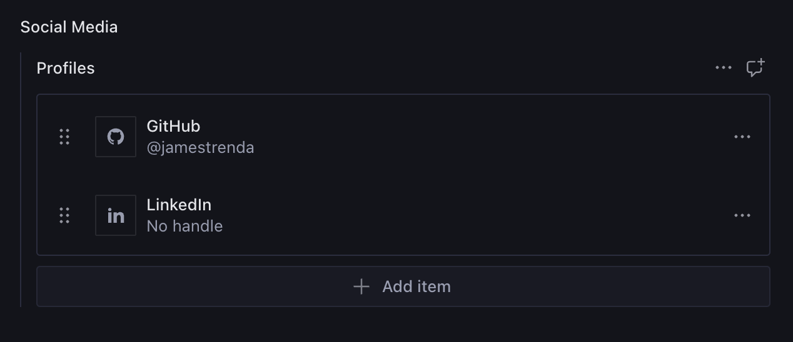
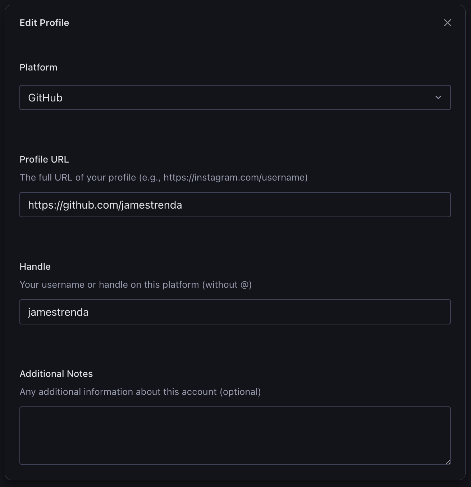

# sanity-plugin-social-media-profiles

> This is a **Sanity Studio v3** plugin.

Just some boilerplate for adding social media profile fields to your settings singleton document (or wherever else you might need it).

## Installation

```sh
npm install sanity-plugin-social-media-profiles
```

## Usage

Add it as a plugin in `sanity.config.ts` (or .js):

```ts
import {defineConfig} from 'sanity'
import {SocialMediaProfilesPlugin} from 'sanity-plugin-social-media-profiles'

export default defineConfig({
  //...
  plugins: [SocialMediaProfilesPlugin()],
})
```

Use the schema in your own schema definition:

```ts
// siteSettings.ts for instance

defineField({
  name: "social",
  title: "Social Media",
  type: "socialMedia", // schema type added by plugin
  group: "social",
}),
```

### Studio Preview:

This is what the above schema field will look like in your Studio. I've added two items in the example below. You can add as many items as the Studio will let you. I didn't feel like there was a good reason to limit the amount of items or validate for uniqueness. While uncommon, you might have multiple profiles per platform that you want to add.





## Icons

This should go without saying, but there are no icon references included in the schema, so you cannot query for them in your GROQ. They're not technically necessary for the schema, but I thought they made for a slightly better list preview. The icons are simply there for the Studio preview. Therefore, you are responsible for rendering the platform icons on your front end using your own preferred icon library.

I chose [Remix Icons](https://remixicon.com) because my preferred icon libraries for Sanity Studio (Sanity Icons and Lucide) did not have a wide enough selection of brand platform icons.

## License

[MIT](LICENSE) © James Trenda

## Develop & test

This plugin uses [@sanity/plugin-kit](https://github.com/sanity-io/plugin-kit)
with default configuration for build & watch scripts.

See [Testing a plugin in Sanity Studio](https://github.com/sanity-io/plugin-kit#testing-a-plugin-in-sanity-studio)
on how to run this plugin with hotreload in the studio.
